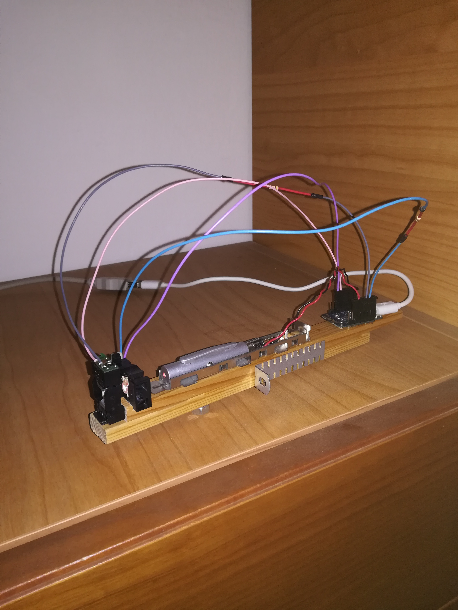
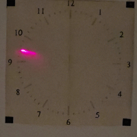
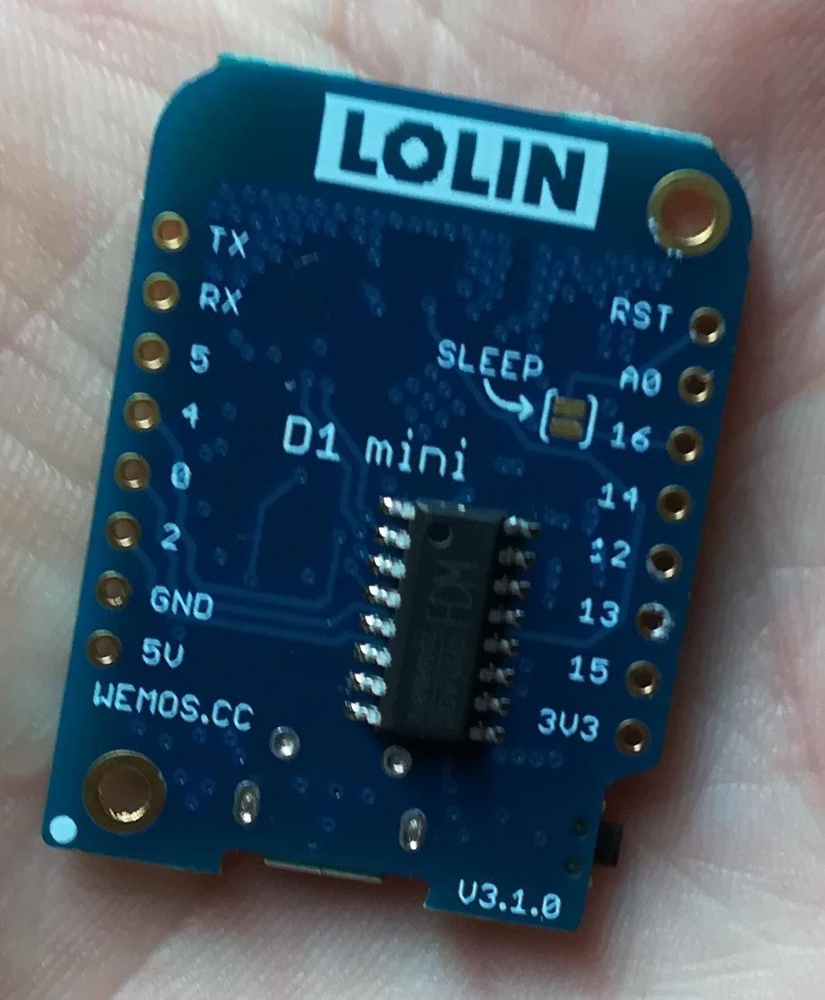
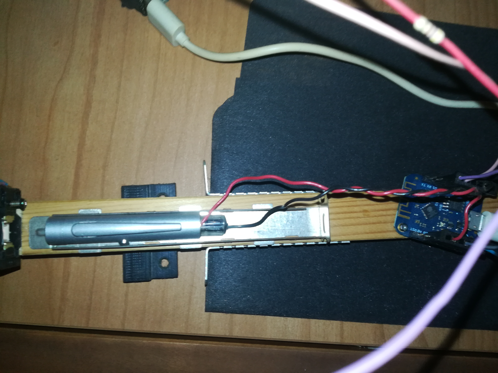

# Laserclock
laser projected wall clock

Two lenses (taken from old CD-ROM drives) are aligned to project a red dot onto a wall three meters away. The first lens moves the dot vertically, while the second moves it horizontally. An ESP8266 drives the lenses using two sinusoidal waves. Since the two signals are in phase, the dot becomes a line. The orientation of the line is controlled by reducing the amplitude of the signals.

$$
ax = \sin(\text{angle})
$$
$$
ay = \cos(\text{angle})
$$

The resonace frequency is 70Hz. The clock hands (arrows) are created by rapidly turning the laser LED on and off. When connected to a Wi-Fi hotspot, the time is automatically synchronized with an NTP server, and daylight saving time (DST) is automatically taken into account.

